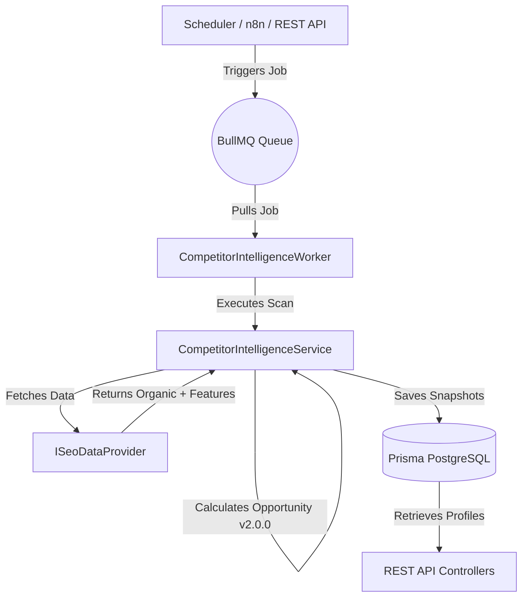

# Competitor Intelligence & SERP Analysis Engine

The **Competitor Intelligence & SERP Analysis Engine** is a core component of **WorkoraJobs**, designed to continuously scan organic Search Engine Results Pages (SERPs), discover direct/indirect competitors, identify content gaps, and track opportunities over time. This backend service operates asynchronously, utilizing horizontal queues, interchangeable providers, and robust mathematical scoring models.

---

## Architecture Overview

The system follows a decoupling-first approach using specialized repositories, abstract SEO providers, and high-performance queues.



### Key Modules:
1. **Competitor Discovery Module**: Dynamically scans organic SERPs and extracts competing domains, allocating Domain Authority and classifying market players over time.
2. **SERP Snapshots Engine**: Captures full-spectrum SERP features: featured snippets, AI overviews, People Also Ask (PAA) cards, ads, local packs, and related search queries.
3. **Content Gap Analyzer**: Compares competitor footprint profiles against own target domains to identify missing topic clusters, salary pages, interview guides, and geographic target opportunities.
4. **Opportunity Scorer (Formula v2.0.0)**: Calculates immediate priorities using multi-weighted indicators (search volume, difficulty, competitor domain authority weakness, and SERP volatility).

---

## Data Model (Prisma Representation)

### Competitor Table
Holds identity metrics and cached authority details for individual competitor domains.

```prisma
model Competitor {
  id          String       @id @default(uuid())
  domain      String       @unique
  authority   Int          @default(0) // Domain Authority / Domain Rating
  metadata    Json?        // For storing index pages, category breakdown, publish frequency, backlink stats, technical SEO factors, growth trends
  createdAt   DateTime     @default(now())
  updatedAt   DateTime     @updatedAt
  serpResults SerpResult[]
}
```

### SerpResult Table
Maintains historical and current positional organic entries linked to keyword queries and competitor records.

```prisma
model SerpResult {
  id           String      @id @default(uuid())
  keywordId    String
  url          String
  title        String
  snippet      String?
  position     Int
  domain       String
  competitorId String?
  metadata     Json?       // Stores search features: featured snippet detail, PAA questions, related searches, AI overviews, local packs, video/image packs, ads status, rich results
  createdAt    DateTime    @default(now())
  keyword      Keyword     @relation(fields: [keywordId], references: [id], onDelete: Cascade)
  competitor   Competitor? @relation(fields: [competitorId], references: [id], onDelete: SetNull)

  @@index([keywordId])
  @@index([competitorId])
  @@index([domain])
}
```

---

## Background Queue Architecture

High-throughput processes run asynchronously inside **BullMQ** to prevent locking up standard API response loops and database processes.

- **Queue Name**: `competitor-intelligence`
- **Concurrency Rate**: `2` parallel executions per Node container.
- **Rate Limiter**: Clamped at `5` executions per second to preserve outbound API credits.

### Supported Job Actions:
1. **`analyze-keyword`**: Executes a complete SERP fetch, updates keyword opportunity records, and processes competitor profiles.
2. **`global-discovery`**: Crawls organic listings across top-performing keywords to discover emerging local and niche competitors.
3. **`refresh-profiles`**: Aggregates ranking performance to update Domain Footprint, indexing counts, and PageSpeed metrics for all registered competitors.
4. **`gap-analysis`**: Generates pre-cached content gap reports compared against target competitors.

---

## API Specifications

All endpoints are prefix-wrapped inside `/api/v1` and protected using authentication and Role-Based Access Control (RBAC).

### 1. Execute Keyword Analysis
Triggers an immediate SERP scrape and analysis for a given keyword query.
- **Endpoint**: `POST /api/v1/competitors/analyze-keyword`
- **Required Permission**: `api.manage`
- **Request Body**:
```json
{
  "keyword": "react engineer jobs",
  "keywordId": "a901fd5a-73c2-4014-b65b-db097cd92113",
  "country": "US",
  "language": "en"
}
```
- **Success Response (200 OK)**:
```json
{
  "success": true,
  "message": "Keyword competition analysis successfully processed.",
  "data": {
    "processedResults": 10,
    "newCompetitorsDiscovered": 2,
    "features": {
      "featuredSnippet": { "present": true, "text": "...", "url": "..." },
      "aiOverview": { "present": true, "text": "..." },
      "peopleAlsoAsk": [],
      "relatedSearches": [],
      "hasAds": true
    }
  }
}
```

### 2. List Competitors
Lists compiled competitor domain profiles with support for search, pagination, and sorting.
- **Endpoint**: `GET /api/v1/competitors`
- **Parameters**: `page`, `limit`, `search`, `minAuthority`, `maxAuthority`, `sortBy`, `sortOrder`
- **Success Response (200 OK)**:
```json
{
  "success": true,
  "message": "Successfully retrieved competitor profiles.",
  "data": [
    {
      "id": "c001fd5a-73c2-4014-b65b-db097cd92114",
      "domain": "indeed.com",
      "authority": 89,
      "metadata": {
        "indexedPagesCount": 14000,
        "contentCategories": ["tech", "finance"],
        "publishingFrequency": "daily"
      }
    }
  ],
  "meta": { "page": 1, "limit": 20, "total": 1 }
}
```

### 3. Retrieve Content Gaps
Retrieves high-priority keyword queries that a specified competitor ranks for in positions 1-10, but our system does not target or lacks rank visibility.
- **Endpoint**: `GET /api/v1/competitors/gaps`
- **Parameters**: `targetCompetitor` (e.g. `linkedin.com`), `page`, `limit`
- **Success Response (200 OK)**:
```json
{
  "success": true,
  "message": "Content gap analysis complete for domain: linkedin.com",
  "data": [
    {
      "keyword": "how to prepare for python coding interview",
      "category": "python",
      "difficulty": 30,
      "searchVolume": 1200,
      "competitorRank": 2,
      "competitorUrl": "https://www.linkedin.com/pulse/python...",
      "recommendedPageType": "Interview Practice Hub",
      "opportunityScore": 84.5
    }
  ],
  "meta": { "page": 1, "limit": 20, "total": 14 }
}
```

---

## Extension Guide: Custom SEO Data Providers

The system is fully modular and supports adding any organic SEO API (e.g. ValueSERP, SerpApi, DataForSeo) by implementing the `ISeoDataProvider` interface.

### Implementing a Provider
1. Create a custom implementation of `ISeoDataProvider`:
```typescript
import { ISeoDataProvider, CrawlResult } from '../services/CompetitorIntelligenceService.js';

export class CustomValueSerpProvider implements ISeoDataProvider {
  name = 'ValueSerpApi';

  async fetchSerp(keyword: string, country: string, language: string): Promise<CrawlResult> {
    // 1. Call external ValueSERP API
    // 2. Parse organic results & SERP features
    // 3. Return mapped CrawlResult object
  }
}
```
2. Load the provider at boot time or inside your routing context:
```typescript
import { CompetitorIntelligenceService } from './services/CompetitorIntelligenceService.js';
import { CustomValueSerpProvider } from './providers/CustomValueSerpProvider.js';

const service = new CompetitorIntelligenceService();
service.setProvider(new CustomValueSerpProvider());
```

---

## Performance Tuning Guide

Operating at enterprise scale requires strict memory boundaries and database optimization.

1. **Subsecond Filters & Indexes**: Explicit PostgreSQL indexes are placed on the `keywordId`, `competitorId`, and `domain` columns inside the `SerpResult` table.
2. **Snapshot Archiving**: In high-velocity environments, clear old `SerpResult` snapshots prior to recording fresh daily logs. This prevents redundant record accumulation.
3. **Query Throttling & Lazy Caching**: Read-heavy endpoints (such as `list` and `compareDomains`) are easily cached on Redis using the `cache` wrapper with a standard TTL of 3600 seconds to protect main CPU layers.
4. **Sequenced Transactions**: Bulk database operations execute within controlled, sequential loop processes to avoid index page fragmentation and deadlock risk under high system concurrency.
