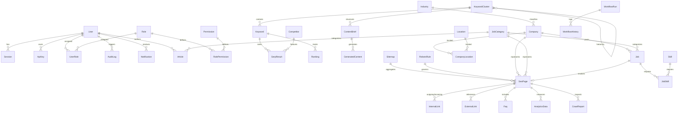

# WorkoraJobs: Enterprise Database & Schema Documentation

This document describes the design, entity structures, and relationships of the WorkoraJobs PostgreSQL Database. The schema is constructed using Prisma ORM.

---

## Entity-Relationship (ER) Diagram

---

## 1. Domain Modules & Tables

### A. Authentication & RBAC Module
* **`User`**: Core accounts tracking standard credentials, timestamps, and active flags. Supports soft delete.
* **`Role`**: Permissions aggregate classification container (ADMIN, EDITOR, WRITER, VIEWER).
* **`Permission`**: Granular operational labels (e.g. `keyword:create`).
* **`UserRole`**: Join table binding users to Roles.
* **`RolePermission`**: Join table binding Roles to Permissions.
* **`Session`**: Stateless/Stateful hybrid tracking active tokens, device user agents, and IP addresses.
* **`ApiKey`**: Key storage mapping external client calls securely.

### B. SEO Module
* **`Keyword`**: Core search engine target metrics (Volume, Difficulty, Search Intent).
* **`KeywordCluster`**: Semantic grouping node mapping keywords into logical topics to generate authoritative content briefs.
* **`Competitor`**: Competitor tracking details.
* **`SerpResult`**: Ranks and page details gathered via Google search results tracking competitor rankings.
* **`ContentBrief`**: Structural guide for content creation referencing lexical requirements.
* **`GeneratedContent`**: Output from Gemini LLMs, tracking parameters, prompt configurations, and raw tokens count.
* **`SeoPage`**: Root programmatic web page model (Slug, Meta Tags, Structured JSON-LD Schema markup, Content HTML).
* **`InternalLink`**: Automates internal linking vectors mapping source anchors to target pages.
* **`ExternalLink`**: Tracks external citations.
* **`Image` & `Faq`**: Media and dynamic components mapped to SEO Pages to increase rich snippets coverage.
* **`Redirect`**: Rule configurations ensuring broken URLs map seamlessly to valid routes with standard status codes.
* **`Sitemap` & `RobotsRule`**: Governance elements indexing correct paths for crawlers.

### C. Jobs Module
* **`Company`**: Standard company detail attributes.
* **`Location`**: Cities, States, and Coordinates backing structural regional programmatic SEO pages (e.g. `/jobs/in-austin-tx`).
* **`JobCategory`**: Professional domains (e.g. "Software Engineering").
* **`Job`**: Core job post (Description, Skills Required, Compensation bounds, Location types).
* **`Skill`**: Technology skill metrics mapping keywords to requirements.

### D. Content Module
* **`Article`**: Blog and editorial pages.
* **`Guide`**: Multi-chapter comprehensive programmatic references.
* **`InterviewQuestion`**: Interactive quiz data for user engagement metrics.

### E. Analytics Module
* **`Ranking`**: Search engine rank metrics over time.
* **`SearchConsoleData`**: Direct Google Search Console dashboard parameters (Clicks, Impressions, CTR, organic position).
* **`AnalyticsData` & `CrawlReport`**: In-app performance tracking, page-view times, and status audits.

### F. Automation & Administration
* **`WorkflowRun` & `WorkflowHistory`**: Auditing execution records triggered via n8n automation tasks.
* **`QueueJob`**: Relational logging mirror for BullMQ state inspections.
* **`AuditLog`**: Security compliance entries tracking mutations across major models.
* **`SystemSetting` & `FeatureFlag`**: Runtime dynamic configuration parameters and safe rolling feature releases.
