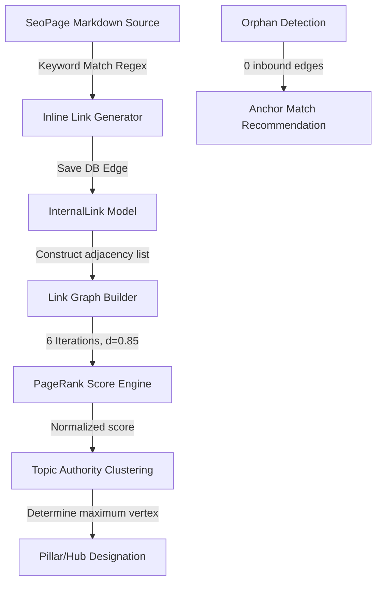

# Enterprise Internal Linking, Topic Authority & Link Graph Engine

This document provides a technical specification, algorithm guide, and operational manual for the **Enterprise Internal Linking, Topic Authority & Link Graph Engine** designed for **WorkoraJobs**.

This engine is responsible for automatically mapping, creating, managing, and continuously optimizing the internal linking topology of millions of dynamic career, company, job, and category pages, maximizing topical semantic authority and search crawlability.

---

## 1. Architecture & Semantic Design

The linking engine models pages and links as a directed multi-layered graph $G = (V, E)$, where vertices $V$ are pages and edges $E$ represent internal hypertext links with custom metadata contexts.



---

## 2. Mathematical PageRank Algorithm & Equity Flow

To distribute internal page juice (link equity) optimally, the system calculates a localized, normalized PageRank score for each page:

$$PR(p) = \frac{1-d}{N} + d \sum_{q \in In(p)} \frac{PR(q)}{Out(q)}$$

Where:
- $N$ is the total page count.
- $d = 0.85$ is the damping factor.
- $In(p)$ is the set of pages linking to page $p$.
- $Out(q)$ is the out-degree of page $q$.

Scores are calculated using 6 iterations for high performance and are normalized to a $0 - 100$ scale for visual presentation inside the administrative dashboards.

---

## 3. Topic Clusters & Pillar Page Selection

Pages are categorized dynamically based on Category and Company relationships into structured semantic hubs:
1. **Pillar Pages**: The highest authority vertex inside a topic cluster (e.g. `Java Developer Careers`).
2. **Spoke Pages**: Highly specific supporting content (e.g. `Staff Java Architect Jobs in Seattle`).

The Topic Authority score is defined as:

$$T(C) = \sum_{v \in C} PR(v)$$

---

## 4. API Reference

All routes are secured under RBAC authorization controls.

### 1. Retrieve Complete Link Graph
- **Endpoint**: `GET /api/v1/links/graph`
- **Response**:
  ```json
  {
    "success": true,
    "data": {
      "nodes": [
        { "id": "uuid-1", "slug": "software-engineer", "title": "Software Engineer", "type": "category", "isPublished": true, "authorityScore": 85 }
      ],
      "edges": [
        { "id": "edge-1", "source": "uuid-2", "target": "uuid-1", "anchorText": "Software Engineer", "isAutoGenerated": true }
      ]
    }
  }
  ```

### 2. Auto-Generate Internal Links (Context-Aware)
- **Endpoint**: `POST /api/v1/links/generate`
- **RBAC Role**: `api.manage`
- **Request Body**:
  ```json
  {
    "sourcePageId": "source-uuid-here",
    "dryRun": false
  }
  ```
- **Response**: Matches unlinked keyword entities inside markdown text with target destination pages and inserts up to 3 contextually optimized links automatically.

### 3. Orphan Page Discovery & Healing
- **Endpoint**: `GET /api/v1/links/orphans`
- **Response**: Returns a list of pages with zero incoming edges along with semantic similarities, category overlaps, and recommended matching anchor text candidates.

### 4. Dynamic Breadcrumbs Planner
- **Endpoint**: `GET /api/v1/links/breadcrumbs/:id`
- **Response**: Generates structural category, company, and location-based breadcrumbs dynamically.

---

## 5. BullMQ Workers & Redis Performance Scaling

- **Queue**: `internal-linking`
- **Performance**: Graph queries are fully cached using Redis key-value pairs (`seo:link_graph`) with a 10-minute TTL (Time To Live).
- **Concurrency**: Capped at `1` concurrent worker per thread to avoid database table locks and deadlock events during transactions.
