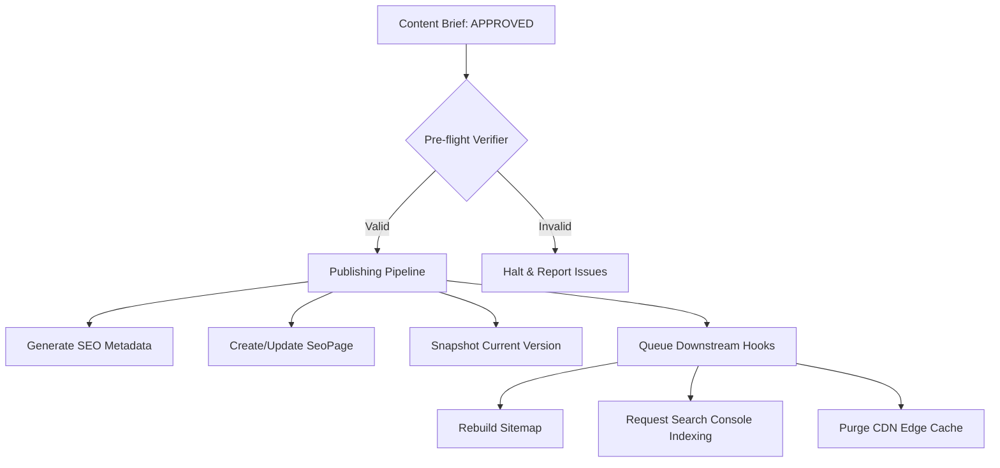

# Enterprise Publishing, Versioning & Content Lifecycle Management Engine

This document provides a technical specification and architecture overview for the **Enterprise Publishing, Versioning & Content Lifecycle Management Engine** built for **WorkoraJobs**.

This engine is the central gateway translating approved content drafts into highly optimized, high-performance live production pages (represented as `SeoPage` database records), maintaining complete historical records, and orchestrating delayed scheduling, safe rollbacks, and multi-site configuration.

---

## 1. Architecture Overview

The system utilizes a modular, queue-backed, event-driven publishing pipeline to ensure atomic updates and maximum reliability when deploying content live or scheduling it for future release.



### Core Components

1. **`ContentPublishingService`**: The orchestrator of the publishing process, enforcing pre-flight validation rules, compiling Markdown to clean HTML formats, capturing immutable historical snapshot structures, and executing atomic rollback and state-transition logic.
2. **`SeoPageRepository`**: Implements database abstraction for production pages, enabling fast paginated queries, full-text searches, and state updates.
3. **`ContentPublishingWorker`**: A background BullMQ-powered consumer processing delayed publishing actions, batch jobs, and multi-site distribution tasks asynchronously.
4. **`ContentPublishingController`**: Maps clean REST APIs to frontend or automation callers like n8n, ensuring that authentication, RBAC authorization, and input validation bounds are strictly enforced.

---

## 2. Content Lifecycle Management Framework

To handle millions of pages at enterprise scale, the engine defines a high-fidelity state machine that maps user progress from the drafting phase all the way to archival, utilizing strict programmatic guards to prevent illegal transitions.

### Extended Lifecycle States

| State | Prisma Basic Status | Description |
| :--- | :--- | :--- |
| **DRAFT** | `DRAFT` | Initial drafting state. Editable by writers. |
| **UNDER_REVIEW** | `REVIEWING` | Draft complete. Under active quality and editorial review. |
| **APPROVED** | `APPROVED` | Passed quality, QA score and editor review thresholds. Ready to release. |
| **SCHEDULED** | `APPROVED` | Scheduled for automated publication at a future date-time. |
| **PUBLISHING** | `APPROVED` | Actively processing the release pipeline within background workers. |
| **PUBLISHED** | `PUBLISHED` | Content is live on production site and active. |
| **UPDATED** | `PUBLISHED` | A modified version or rollback version was deployed over the initial release. |
| **ARCHIVED** | `DRAFT` | Page taken offline / hidden from users, but metadata is retained. |
| **EXPIRED** | `DRAFT` | Reached custom lifecycle expiration date. Hidden from production. |
| **DELETED** | `DRAFT` | Soft-deleted / ready for garbage collection. |

### Lifecycle State Transition Matrix

Every transition is checked programmatically against the allowed matrix before modifying the database state:

```
[DRAFT] --------> [UNDER_REVIEW] -------> [APPROVED] --------> [PUBLISHED] <-----> [UPDATED]
   |                     |                   |  |                     |                |
   v                     v                   v  v                     v                v
[DELETED]            [DELETED]            [SCHEDULED]            [ARCHIVED]       [ARCHIVED]
                                             |  |                     |                |
                                             v  v                     v                v
                                          [PUBLISHING]            [EXPIRED]        [EXPIRED]
```

---

## 3. Immutable Version snapshots & History

Every publication or rollback creates a new, immutable historical snapshot that is added to the version history of the corresponding `ContentBrief.metadata.versionHistory` field.

### Version Snapshot Schema

```json
{
  "version": "v1.0",
  "publishedAt": "2026-07-18T23:45:00.000Z",
  "publishedBy": "user-uuid-here",
  "changeSummary": "Initial publishing release",
  "siteId": "workorajobs.com",
  "seoPageSnapshot": {
    "slug": "enterprise-java-jobs",
    "url": "https://workorajobs.com/careers/enterprise-java-jobs",
    "title": "Enterprise Java Jobs",
    "h1": "Enterprise Java Jobs in Seattle & Silicon Valley",
    "metaTitle": "Best Enterprise Java Jobs - Career Guide",
    "metaDescription": "Explore active high-paying Java engineering positions and expert interviewing preparation strategies.",
    "contentHtml": "<h1>Enterprise Java Jobs...</h1><p>...</p>",
    "contentMarkdown": "# Enterprise Java Jobs...",
    "schemaMarkup": {
      "@context": "https://schema.org",
      "@type": "WebPage",
      "name": "Enterprise Java Jobs"
    }
  }
}
```

This self-contained structure allows:
- **Zero-downtime Rollbacks**: Instantly restoring previous states without reloading static data.
- **Visual Version Comparison**: Allowing editorial dashboards to render side-by-side differentials (diffs) of text and layout.
- **Decoupled Backups**: Easy archival, backup, and restore routines.

---

## 4. API Reference

### Publish Content (Instant or Async)
- **Endpoint**: `POST /api/v1/briefs/:id/publish`
- **RBAC Permission**: `api.manage`
- **Request Body**:
  ```json
  {
    "draftId": "uuid-of-the-approved-draft",
    "changeSummary": "Initial publication release",
    "siteId": "workorajobs.com",
    "async": false
  }
  ```
- **Response**:
  ```json
  {
    "success": true,
    "message": "Content published to production successfully.",
    "data": {
      "success": true,
      "seoPage": { "id": "page-uuid", "slug": "...", "url": "..." },
      "version": "v1.0",
      "reports": {
        "sitemapQueued": true,
        "indexingQueued": true,
        "cacheInvalidated": true
      }
    }
  }
  ```

### Schedule Publishing
- **Endpoint**: `POST /api/v1/briefs/:id/schedule`
- **RBAC Permission**: `api.manage`
- **Request Body**:
  ```json
  {
    "draftId": "uuid-of-the-approved-draft",
    "scheduledAt": "2026-07-20T10:00:00.000Z",
    "changeSummary": "Scheduled Monday morning release",
    "siteId": "uk.workorajobs.com"
  }
  ```

### Cancel Scheduled Publication
- **Endpoint**: `POST /api/v1/briefs/:id/cancel-schedule`
- **RBAC Permission**: `api.manage`

### Rollback to Historic Version
- **Endpoint**: `POST /api/v1/briefs/:id/rollback`
- **RBAC Permission**: `api.manage`
- **Request Body**:
  ```json
  {
    "version": "v1.0"
  }
  ```

### Transition Lifecycle State
- **Endpoint**: `POST /api/v1/briefs/:id/transition-lifecycle`
- **RBAC Permission**: `api.manage`
- **Request Body**:
  ```json
  {
    "targetState": "UNDER_REVIEW",
    "reason": "Draft has been finalized, ready for editorial review."
  }
  ```

### Archive Page (Offline)
- **Endpoint**: `POST /api/v1/briefs/:id/archive-page`
- **RBAC Permission**: `api.manage`

### Restore Archived Page
- **Endpoint**: `POST /api/v1/briefs/:id/restore-page`
- **RBAC Permission**: `api.manage`

### Retrieve Version History
- **Endpoint**: `GET /api/v1/briefs/:id/version-history`
- **RBAC Permission**: No restriction (Authenticated only)

### List SEO Pages (Dashboard support)
- **Endpoint**: `GET /api/v1/seo-pages`
- **Query Params**:
  - `page` (default `1`)
  - `limit` (default `10`)
  - `search` (optional keyword)
  - `isPublished` (`true`/`false`)
  - `sortBy` (`createdAt`, `publishedAt`, etc.)
  - `sortOrder` (`asc`/`desc`)

---

## 5. Background Queue Architecture

Scheduling and asynchronous releases rely on robust Redis-backed **BullMQ** job workers to ensure fault tolerance, retry metrics, and horizontal scalability.

### Queue Configuration & Worker Integrity

The background consumer `ContentPublishingWorker` executes inside separate sandbox threads to avoid main-thread blocking during markdown parsing and downstream hook execution:

1. **Concurrency**: Set to `2` to allow parallel publishing processing loops.
2. **Idempotence**: Every operation validates existing pages and uses atomic transactional inserts/upserts.
3. **Fault Tolerance & Retries**: Configured with exponential backoff on failure (`attempts: 3, backoff: 1000ms`).

---

## 6. Performance & Scale Optimizations

To support up to millions of pages without slowing down or degrading database query times:

1. **Redis CDN Invalidation & Caching**: Live `SeoPage` requests in client endpoints are backed by Redis keys. When publishing or rolling back, we trigger programmatic invalidation (`cache.del`) of page paths.
2. **JSON Blob snapshots**: Keeping historical versions embedded inside the specific `ContentBrief` means that standard user queries for live `SeoPage` listing are ultra-fast, single-row primary key reads instead of massive many-to-many relationship table joins.
3. **Database Indexing**: Built-in indexes on `SeoPage` (`slug`, `isPublished`, `categoryId`, `companyId`) guarantee sub-millisecond retrieval.
