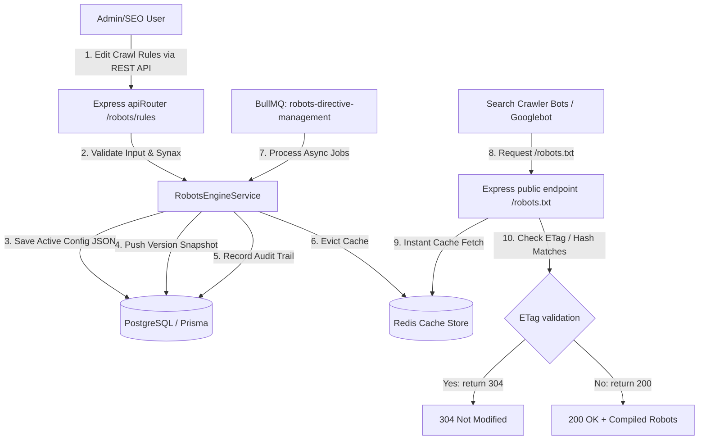

# WorkoraJobs: Enterprise Robots.txt & Crawl Directive Management Engine

This document provides a comprehensive blueprint, API specification, background queue architecture, and developer implementation guide for the production-grade **Enterprise Robots.txt & Crawl Directive Management Engine**.

---

## 1. System Architecture Blueprint

The Robots & Crawl Directive Management Engine handles high-performance, secure crawler traffic. It separates rule administration from crawl agent request serving using Redis caching, making response times `<5ms` and ensuring safety across staging, testing, and production environments.

### Architecture Flow



---

## 2. Robots.txt Compiling & Environment Controls

The compiler handles dynamic layout variations:

* **Non-Production (Staging, Development, Testing)**:
  Automatically ignores any custom rules and outputs a strict disallow-all script to protect search engine duplication and indexing leaks:
  ```text
  User-agent: *
  Disallow: /
  ```
* **Production**:
  Compiles user-defined comments, agent rule groups (Allows, Disallows, Crawl-delays), Host header directives, and Sitemap URL listings.

### Custom Bots Supported

* `*` (Generic crawler fallback)
* `Googlebot`
* `Bingbot`
* `Googlebot-Image`
* `Googlebot-News`
* `AdsBot`
* Custom/User-defined bots (e.g. `twitterbot`, `facebot`)

---

## 3. Crawl Directive Engine (Page Level)

The engine provides unified lookups for pages to govern custom SEO crawler actions:

* **Meta Robots Directives**: Generates the final page-level meta string (e.g., `<meta name="robots" content="index, follow">` or `"noindex, nofollow"`).
* **X-Robots-Tag**: Emits equivalent response headers (`X-Robots-Tag: noindex, nofollow`).
* **Canonical Consistency**: Validates that indexable pages point back to a singular canonical path.
* **Publish Status Locks**: Prevents indexing of unpublished or soft-deleted pages.

---

## 4. REST API Specification

### 4.1 Get Compiled Robots.txt (Public)
* **Endpoint**: `GET /robots.txt`
* **Response**: Raw robots.txt text payload.
* **Headers**:
  * `Content-Type`: `text/plain; charset=utf-8`
  * `ETag`: `W/"<md5-hash>"` (Supports `304 Not Modified` on client caching)

### 4.2 Update Active Crawl Rules (Admin)
* **Endpoint**: `PUT /api/v1/robots/rules`
* **RBAC**: Authenticated, `api.manage`
* **Request Body**:
```json
{
  "config": {
    "environment": "production",
    "sitemaps": ["https://workorajobs.com/sitemap.xml"],
    "host": "workorajobs.com",
    "rules": [
      {
        "userAgent": "*",
        "disallows": ["/admin", "/api", "/drafts"],
        "allows": ["/"],
        "crawlDelay": 2
      }
    ],
    "comments": ["Welcome to WorkoraJobs"]
  },
  "changeLog": "Configured initial production crawler disallows."
}
```
* **Response**:
```json
{
  "success": true,
  "message": "Crawl and Robots.txt rules updated successfully.",
  "data": { ... }
}
```

### 4.3 Validate Custom Robots.txt Syntax (Admin/Editor)
* **Endpoint**: `POST /api/v1/robots/validate`
* **Request Body (Optional - parses current if null)**:
```json
{
  "content": "User-agent: *\nDisallow /no-colon-error"
}
```
* **Response**:
```json
{
  "success": true,
  "data": {
    "isValid": false,
    "errors": [
      "Syntax error on line 2: Missing colon ':' delimiter separator."
    ],
    "warnings": []
  }
}
```

### 4.4 Rollback rules (Admin)
* **Endpoint**: `POST /api/v1/robots/rollback`
* **RBAC**: Authenticated, `api.manage`
* **Request Body**:
```json
{
  "versionId": "v_1718281828"
}
```

### 4.5 Get Crawl Directives for a Page Slug (Public/Proxy)
* **Endpoint**: `GET /api/v1/robots/directives/:slug`
* **Response**:
```json
{
  "success": true,
  "data": {
    "metaRobots": "index, follow",
    "xRobotsTag": "all",
    "canonicalUrl": "https://workorajobs.com/jobs/node-engineer",
    "isIndexable": true
  }
}
```

---

## 5. Background Queue (BullMQ)

* **Queue Name**: `robots-directive-management`
* **Concurrency**: `2`
* **Job Tasks Handled**:
  1. `generate-robots`: Evicts compiled cash from Redis and forces compile.
  2. `sync-rules`: Propagates automated updates across environments.
  3. `version-cleanup`: Standardizes retention rules, keeping version snapshot list below 50.
  4. `bulk-update`: Dynamically merges lists of newly discovered crawl limits.

---

## 6. Developer Guide

### Running Vitest Suites
```bash
npm run test -- src/tests/robots-engine.test.ts
```
