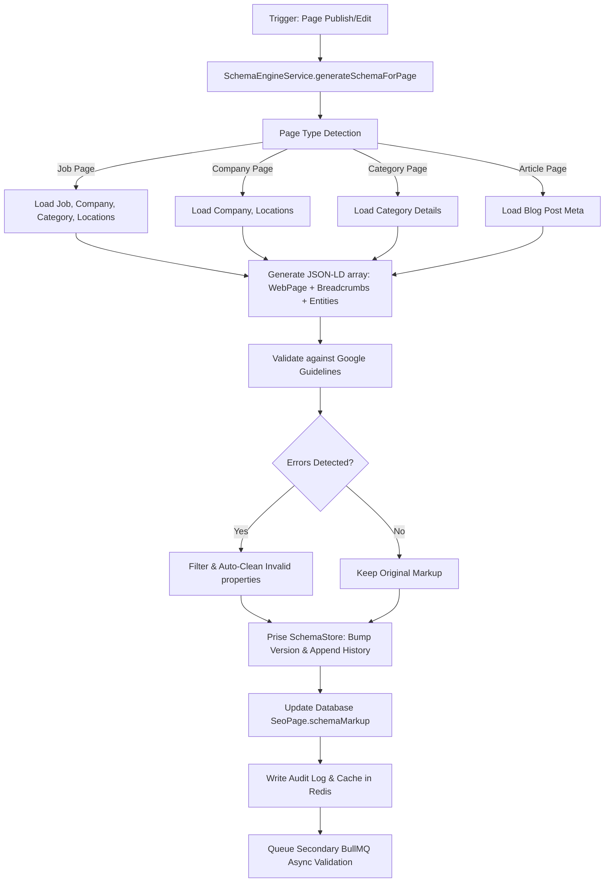

# Enterprise Schema.org & Structured Data Engine

The **Enterprise Schema.org & Structured Data Engine** is a high-performance programmatic SEO pipeline inside **WorkoraJobs**. It dynamically builds, validates, versions, and serves high-fidelity JSON-LD schema objects for every page on the platform to maximize CTR, indexing, and rich search eligibility on Google.

---

## 1. Engine Architecture & Pipeline

The pipeline operates via an isolated, modular strategy where page models are ingested, mapped, validated, cleaned of invalid attributes, and stored as versioned JSON collections.



---

## 2. Supported Schema Templates

The engine fully implements and automates the following templates:

### 1. JobPosting
*Required by Google Jobs search for dynamic inclusion in the Google Jobs widget.*
- **Included Properties**: `title`, `description` (HTML), `datePosted`, `validThrough` (60 days default expiration), `employmentType` (normalized list), `hiringOrganization` (nested Organization with name, logo, sameAs), `jobLocation` (normalized street/city/state/postal/country or `TELECOMMUTE`), `experienceRequirements`, `baseSalary` (MonetaryAmount).

### 2. BreadcrumbList
*Drives rich snippets in Google search result headers indicating directory structures.*
- **Included Properties**: Fully automated hierarchical listings (e.g., `Home` -> `Category` -> `Company` -> `Job`).

### 3. FAQPage
*Extracts interactive FAQ answers inside search snippets if the page has associated question cards.*
- **Included Properties**: `mainEntity` mapping `Question` names directly to `acceptedAnswer` text.

### 4. Organization
*Maintains digital authority for companies and publishers.*
- **Included Properties**: `name`, `url`, `logo`, `description`, `sameAs`.

### 5. Article & NewsArticle
*Optimizes blog posts, career guides, and news updates.*
- **Included Properties**: `headline`, `description`, `datePublished`, `dateModified`, `author` (editorial), `publisher` (WorkoraJobs).

---

## 3. Schema Versioning System

Rather than relying on flat JSON records, `schemaMarkup` is structured as a transaction-safe, self-contained **Schema Store** inside Postgres:

```typescript
export interface SchemaMarkupStore {
  active: any;                 // Active JSON-LD parsed array
  currentVersion: string;      // Current version semver (e.g., "0.0.3")
  versions: SchemaVersion[];   // Full historic array of generated drafts/publishes
  auditHistory: SchemaAuditRecord[]; // Log of actions, authors, and dates
}
```

### Version Lifecycles
1. **Draft**: Compiled when pages are edited or saved as draft.
2. **Published**: Made active on the production page as soon as the SEO page is published.
3. **Archived**: Older records preserved in history when a new version is created.
4. **Rollback**: INSTANT restoration of any previous version with zero downtime.

---

## 4. REST API Specification

### 1. Generate Schema
* `POST /api/v1/schemas/generate`
* **Role required**: `api.manage` (Admin/Editor)
* **Request Body**:
  ```json
  { "pageId": "27182818-2845-9045-2353-602874713526" }
  ```
* **Response**:
  ```json
  {
    "success": true,
    "message": "Schema.org JSON-LD successfully generated.",
    "data": {
      "currentVersion": "0.0.1",
      "validationReport": { "isValid": true, "errors": [], "warnings": [] },
      "schema": { ... }
    }
  }
  ```

### 2. Get Active Schema
* `GET /api/v1/schemas/active/:pageId`
* **Role required**: None (Public)
* **Response**:
  ```json
  {
    "success": true,
    "data": [ ... ]
  }
  ```

### 3. Get Version History & Audits
* `GET /api/v1/schemas/history/:pageId`
* **Role required**: View-only authenticated users
* **Response**:
  ```json
  {
    "success": true,
    "data": {
      "active": { ... },
      "currentVersion": "0.0.3",
      "versions": [ ... ],
      "auditHistory": [ ... ]
    }
  }
  ```

### 4. Rollback Version
* `POST /api/v1/schemas/rollback`
* **Role required**: `api.manage`
* **Request Body**:
  ```json
  {
    "pageId": "27182818-2845-9045-2353-602874713526",
    "version": "0.0.1"
  }
  ```

### 5. Compare Versions
* `GET /api/v1/schemas/compare/:pageId?vA=0.0.1&vB=0.0.2`
* **Role required**: Authenticated users

### 6. Dry-run Custom Validator
* `POST /api/v1/schemas/validate`
* **Request Body**:
  ```json
  {
    "schema": {
      "@context": "https://schema.org",
      "@type": "JobPosting",
      "title": "React Developer"
    }
  }
  ```

---

## 5. Performance & Background Processing

* **Redis Caching**: Active schema markup is stored under the `seo:schema:${pageId}` key with a 10-minute TTL. Public requests hit Redis, bypassing database reads entirely.
* **BullMQ Worker (`SchemaValidationWorker`)**: Offloads bulk schema rebuild and rich third-party validation cycles in the background (using queue name `technical-seo-audits`) to eliminate primary thread blocking.
