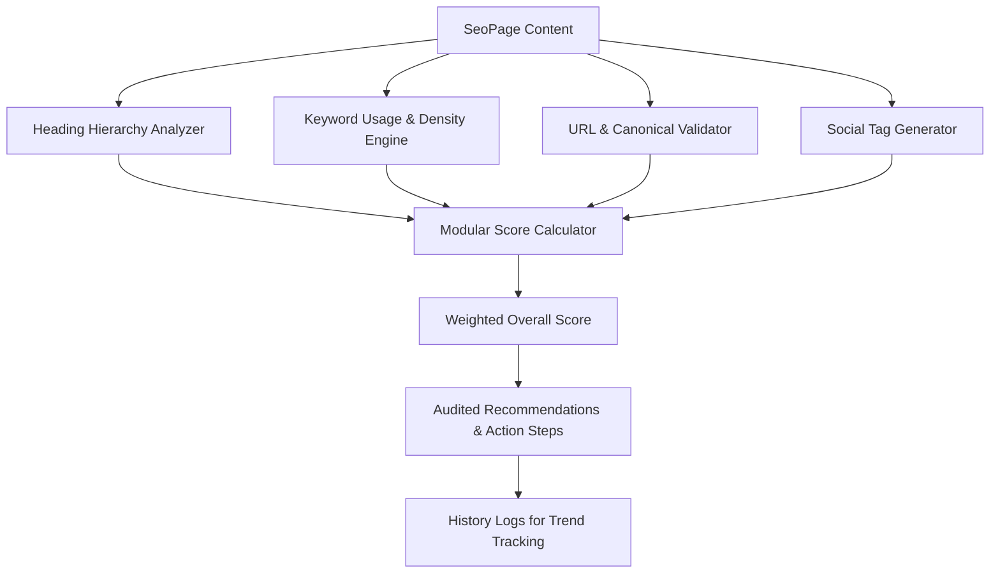

# Enterprise On-Page SEO Optimization & Metadata Management Engine

This document provides a technical specification and operational manual for the **Enterprise On-Page SEO Optimization & Metadata Management Engine** designed for **WorkoraJobs**.

This engine is responsible for automatically auditing, validating, and continuously optimizing on-page elements across millions of dynamically generated career paths and landing pages, ensuring maximum organic search visibility.

---

## 1. Architecture Overview

The system uses a modular, pipelined auditing process that can run synchronously for live user interactions (e.g., SEO dashboard editors) or asynchronously via high-performance background queues.



---

## 2. SEO Scoring Framework

To ensure that editorial teams get objective feedback on content quality, the engine implements a high-fidelity weighted scoring algorithm:

| Category | Weight | Audit Scope |
| :--- | :---: | :--- |
| **Metadata Quality** | 20% | Correct browser and meta title lengths (30-65 chars), meta descriptions (110-165 chars). |
| **Heading Structure** | 15% | Single H1 requirement, logical heading level transitions, absence of skip-levels. |
| **Keyword Density** | 20% | Optimal primary keyword density threshold checks (ideal: 0.6% to 3.0%). |
| **Keyword Placement** | 15% | Keyword inclusion in Meta Title, H1, introductory paragraph (first 150 words), and conclusion (last 150 words). |
| **URL & Canonical** | 15% | Lowcase slugs, no underscores, and strict matching against self-referencing canonical URLs. |
| **Social & Structured Data** | 15% | Completeness of Open Graph (`og:*`), Twitter Cards (`twitter:*`), and Schema.org structured data payloads. |

---

## 3. API Reference

All SEO endpoints are fully authenticated and secure. Below is the API routing specification:

### 1. Generate Metadata
- **Endpoint**: `POST /api/v1/seo/generate`
- **RBAC Role**: `api.manage`
- **Request Body**:
  ```json
  {
    "title": "Staff Java Architect Jobs",
    "primaryKeyword": "Java Architect",
    "siteDomain": "workorajobs.com"
  }
  ```
- **Response**:
  ```json
  {
    "success": true,
    "message": "On-page SEO metadata tags generated successfully.",
    "data": {
      "slug": "staff-java-architect-jobs",
      "metaTitle": "Staff Java Architect Jobs Jobs & Career Path Guide - WorkoraJobs",
      "metaDescription": "Explore premium Staff Java Architect Jobs career opportunities...",
      "browserTitle": "Staff Java Architect Jobs | WorkoraJobs",
      "canonicalUrl": "https://workorajobs.com/careers/staff-java-architect-jobs",
      "robots": "index, follow, max-snippet:-1, max-image-preview:large, max-video-preview:-1"
    }
  }
  ```

### 2. Run Page Audit & Diagnostics
- **Endpoint**: `POST /api/v1/seo/audit`
- **RBAC Role**: `api.manage`
- **Request Body**:
  ```json
  {
    "seoPageId": "page-uuid-here"
  }
  ```
- **Response**: Returns a detailed JSON payload of the computed `SeoReport` including overall scores, category subscores, headings hierarchy lists, keyword placement status, and a list of actionable audit recommendations sorted by severity (`critical`, `warning`, `info`).

### 3. Update Metadata & Redirects
- **Endpoint**: `POST /api/v1/seo/update`
- **RBAC Role**: `api.manage`
- **Request Body**:
  ```json
  {
    "seoPageId": "page-uuid-here",
    "metaTitle": "Fully Optimized New Title - WorkoraJobs",
    "metaDescription": "Optimized meta description to boost click-through rates.",
    "slug": "new-optimized-slug-path"
  }
  ```
- **Behavior**: If the slug path changes, a `301 Redirect` candidate is automatically registered inside the database's `Redirect` table to maintain inbound link equity.

---

## 4. Background Queue Processing

Massive bulk re-optimizations are processed using BullMQ's queue (`technical-seo-audits`):

1. **Idempotency**: All background audit events use transactional upserts.
2. **Concurrency**: Limited to `2` concurrent jobs per worker thread to prevent DB lock contentions.
3. **n8n Interoperability**: n8n can programmatically add jobs to the `technical-seo-audits` queue using standard redis protocols.
