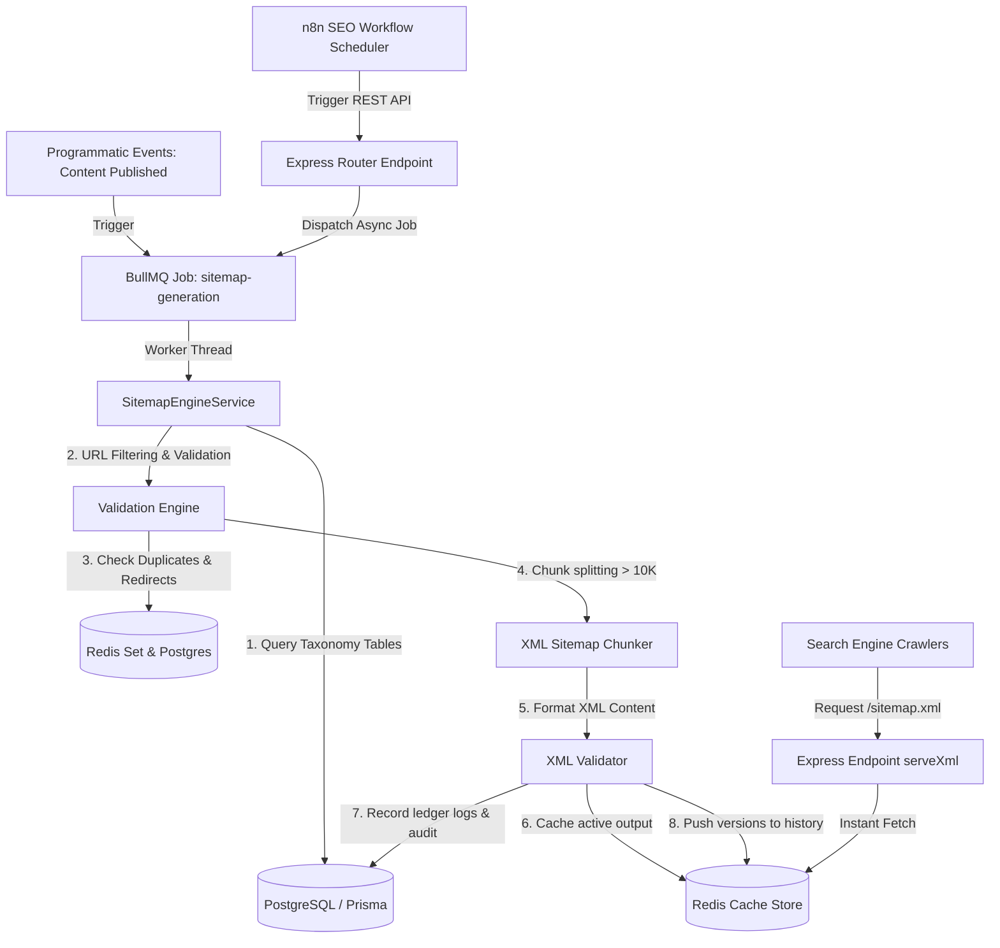

# WorkoraJobs: Enterprise XML Sitemap Management Engine

This document provides a comprehensive blueprint, API specification, background queue architecture, and developer implementation guide for the production-grade **Enterprise XML Sitemap Management Engine**.

---

## 1. System Architecture Blueprint

The Sitemap Management Engine uses a fully decoupled, async-first architecture optimized to process, validate, and serve millions of URLs dynamically with near-zero latency.

### Architecture Overview



---

## 2. Sitemap Generation Pipeline

Every generation cycle executes in a highly sandboxed, modular pipeline where each stage is independently testable:

1. **Event Detection**: Captures publishing events or cron schedules (such as n8n triggers) to start sitemap refreshes.
2. **Eligibility Retrieval**: Queries core Postgres schemas for active SEO pages, jobs, categories, and articles.
3. **Canonical & Syntax Validation**: Validates URL structure, matching domain constraints, valid modified dates, and bounds on priority scores.
4. **Security Exclusion**: Filters out sensitive endpoints, admin areas, user portals, or staging/draft directory matches.
5. **XML Entry Formulation**: Escapes special XML characters to format `<url>` components correctly.
6. **Dynamic Splitting (Chunking)**: Automatically partitions sitemaps exceeding configurable limit boundaries (e.g., 10,000 URLs).
7. **Index Manifest Generation**: Compiles the master `<sitemapindex>` mapping active section chunks.
8. **XML Format Audits**: Runs structural parsers to guarantee valid XML tags, schema structures, and element counts.
9. **Redis Distributed Caching**: Caches output to guarantee high-performance responses for crawl agents.
10. **Version Archiving**: Appends sitemap states to historical archives in cache stores to facilitate instant rollbacks and version diffing.
11. **Downstream Notifications**: Dispatches n8n webhooks or internal pub/sub events.

---

## 3. Supported Taxonomy Types

The engine dynamically segments sitemaps into target taxonomy sections to optimize search indexing:

| Sitemap Type | URL Namespace Path | Change Frequency | Default Priority |
| :--- | :--- | :--- | :--- |
| **Static Pages** | `/` (Home), `/about`, `/contact` | Daily / Monthly | `1.0` / `0.5` |
| **Jobs** | `/jobs/:slug` | Daily | `0.9` |
| **Blogs** | `/blog/:slug` | Weekly | `0.8` |
| **Landing Pages** | (Custom target paths) | Weekly | `0.8` |
| **Companies** | `/companies/:slug` | Weekly | `0.6` |
| **Categories** | `/categories/:slug` | Weekly | `0.7` |
| **Locations** | `/locations/:slug` | Monthly | `0.5` |
| **Skills** | `/skills/:slug` | Monthly | `0.4` |
| **Guides** | `/guides/:slug` | Weekly | `0.7` |
| **Images (Placeholder)**| (Dynamic media CDN) | Monthly | `0.4` |

---

## 4. REST API Documentation

All administrative endpoints require authentication and proper RBAC permission checks (`api.manage`).

### 4.1 Generate Sitemap
* **Endpoint**: `POST /api/v1/sitemaps/generate`
* **RBAC**: Authenticated, `api.manage`
* **Request Body**:
```json
{
  "type": "jobs",
  "async": false
}
```
* **Response (Sync)**:
```json
{
  "success": true,
  "message": "Sitemap successfully generated.",
  "data": {
    "filenames": ["sitemap-jobs.xml"],
    "report": {
      "isValid": true,
      "errors": [],
      "warnings": [],
      "urlCount": 154,
      "duplicateCount": 0,
      "invalidUrls": []
    }
  }
}
```

### 4.2 Refresh Sitemap (Incremental or Full Rebuild)
* **Endpoint**: `POST /api/v1/sitemaps/refresh`
* **RBAC**: Authenticated, `api.manage`
* **Request Body**:
```json
{
  "all": true,
  "async": true
}
```
* **Response (Async)**:
```json
{
  "success": true,
  "message": "Refresh sitemap task successfully queued.",
  "data": {
    "jobId": "bulk-rebuild-123"
  }
}
```

### 4.3 Get Sitemap Cache Status
* **Endpoint**: `GET /api/v1/sitemaps/status`
* **RBAC**: Authenticated
* **Response**:
```json
{
  "success": true,
  "data": [
    {
      "id": "uuid-1",
      "filename": "sitemap-jobs.xml",
      "urlCount": 154,
      "isActive": true,
      "lastGeneratedAt": "2026-07-19T07:14:26.536Z"
    }
  ]
}
```

### 4.4 Get Version History
* **Endpoint**: `GET /api/v1/sitemaps/history/:filename`
* **RBAC**: Authenticated
* **Response**:
```json
{
  "success": true,
  "data": [
    {
      "versionId": "v_1718281828",
      "filename": "sitemap-static.xml",
      "urlCount": 5,
      "generatedAt": "2026-07-19T07:14:26.536Z",
      "createdBy": "admin-id",
      "validationReport": {
        "isValid": true,
        "errors": [],
        "warnings": [],
        "urlCount": 5,
        "duplicateCount": 0
      },
      "changeLog": "Generated sitemap with 5 URLs."
    }
  ]
}
```

### 4.5 Rollback Sitemap Version
* **Endpoint**: `POST /api/v1/sitemaps/rollback`
* **RBAC**: Authenticated, `api.manage`
* **Request Body**:
```json
{
  "filename": "sitemap-static.xml",
  "versionId": "v_1718281828"
}
```
* **Response**:
```json
{
  "success": true,
  "message": "Sitemap file sitemap-static.xml successfully rolled back to version v_1718281828.",
  "data": {
    "versionId": "v_1718281828",
    "filename": "sitemap-static.xml",
    "urlCount": 5
  }
}
```

### 4.6 Compare Sitemap Versions
* **Endpoint**: `POST /api/v1/sitemaps/compare`
* **RBAC**: Authenticated, `api.manage`
* **Request Body**:
```json
{
  "filename": "sitemap-static.xml",
  "versionA": "v1",
  "versionB": "v2"
}
```
* **Response**:
```json
{
  "success": true,
  "data": {
    "versionA": { "versionId": "v1", "urlCount": 2 },
    "versionB": { "versionId": "v2", "urlCount": 3 },
    "additions": ["https://workorajobs.com/blog/new-launch"],
    "removals": []
  }
}
```

---

## 5. Queue & Background Processing (BullMQ)

The engine leverages BullMQ over Redis to delegate heavy-duty XML processing tasks, ensuring horizontal scalability.

### Workers Configuration

* **Queue Name**: `sitemap-generation`
* **Concurrency**: `2` (Highly optimized thread execution limits)
* **Idempotency**: Handled via job IDs mapping sitemap categories and execution timestamps to avoid duplicate concurrent tasks.

### Queue Tasks

1. **`generate-sitemap`**: Generates and caches a specific taxonomy category.
2. **`bulk-regeneration`**: Iterates across all types to run a full site-wide rebuild.
3. **`incremental-refresh`**: Re-evaluates taxonomy records to selectively append or rebuild single category chunks.
4. **`validate-sitemap`**: Audits existing cached sitemap strings to emit diagnostic validation reports.

---

## 6. Developer Guide

### Triggering Generation Event programmatically
To trigger sitemap regeneration when publishing an article or job:

```typescript
import { getQueue } from '../core/queues/index.js';

async function onPagePublished(type: string) {
  const queue = getQueue('sitemap-generation');
  if (queue) {
    await queue.add('incremental-refresh', { type });
  }
}
```

### Running the Test Suite
The entire test suite is verified using Vitest. Run sitemap-specific unit and integration tests:

```bash
npm run test -- src/tests/sitemap-engine.test.ts
```
