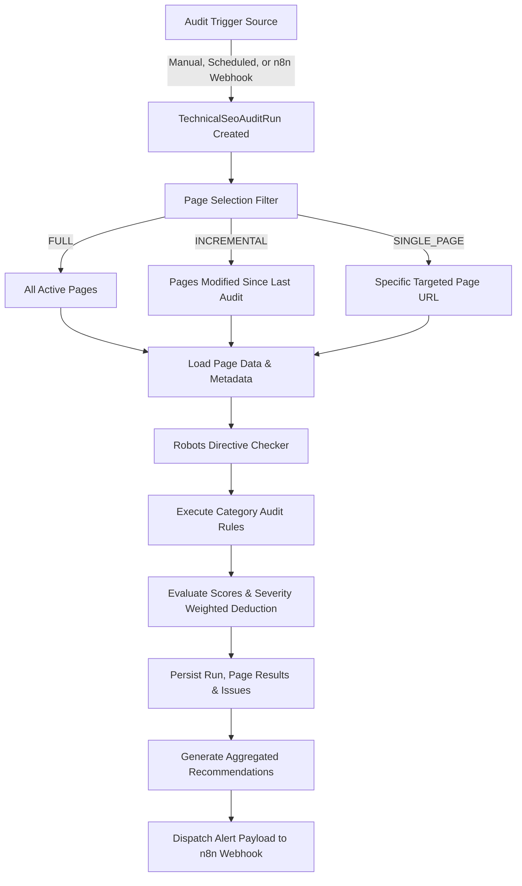

# WorkoraJobs Technical SEO Audit & Site Health Monitoring Engine

The **Technical SEO Audit & Site Health Monitoring Engine** completes the technical SEO infrastructure core module of WorkoraJobs. It performs automated, parallel crawls of database-defined programmatic pages, checks them against critical and informational SEO guidelines, weights the findings, assigns weighted Health Scores, generates action-oriented Recommendations, and schedules remediation workflows through n8n automation triggers.

---

## Technical Architecture



---

## Core Pipeline Flow

The engine implements a highly modular, decoupled pipeline processing system:

1. **Trigger Intake**: Determines trigger source (`MANUAL`, `SCHEDULED`, `N8N_WEBHOOK`) and creates the `TechnicalSeoAuditRun` with `PENDING` status.
2. **Page Selection**: Selects `SeoPage` records based on the Audit Type (`FULL`, `INCREMENTAL`, `SINGLE_PAGE`).
3. **Data Loading**: Eagerly queries relational models (incoming links, outgoing links, schema markup, robots rule and FAQs).
4. **Directives Evaluation**: Hits the `RobotsEngineService` to evaluate user-agent restriction parameters dynamically.
5. **Rule Execution**: Validates page compliance across 8 distinct SEO disciplines.
6. **Weighted Health Scoring**: Calculates health scores (0-100) per category based on severity-deducted penalties, then produces an overall site-health rating using customizable weight criteria.
7. **Persistence**: Saves records atomically inside `TechnicalSeoPageAuditResult` and `TechnicalSeoIssue` tables.
8. **Recommendation Compilation**: Groups identical page issues into structured, prioritized site recommendations.
9. **Automation Dispatch**: Dispatches standard JSON telemetry hooks to downstream n8n systems to initiate corrective action tasks or alerting systems.

---

## Category Auditing Specifications

### 1. Crawlability
- **HTTP status codes**: Confirms if the page is draft (returns simulated 403) or soft-deleted (returns simulated 404).
- **Robots directives**: Evaluates active disallow limits against RobotsRule definitions.
- **Canonical consistency**: Compares `canonicalUrl` with current `url`.
- **Crawl depth**: Tracks folder hierarchy deepness (flagged if depth > 4).
- **Internal linking quality**: Checks if incoming links density is critically low (< 2).

### 2. Indexability
- **Noindex pages**: Scans for blocking noindex tags.
- **Duplicate canonicals**: Flags pages matching canonical targets already claimed elsewhere.
- **Sitemap inclusion**: Validates mapping to the XML Sitemap system index.
- **Thin pages**: Flags word counts below the target threshold.
- **Orphan pages**: Detects pages with 0 internal incoming links.

### 3. Metadata
- **Missing / Duplicate title**: Ensures title existence and uniqueness.
- **Optimal length title**: Alerts if characters are outside optimal limits (30 - 60).
- **Missing / Duplicate description**: Validates presence and character density limits (50 - 160).
- **Open Graph / Twitter Cards**: Confirms presence of social sharing metadata.

### 4. Structured Data
- **JSON-LD syntax**: Validates parsing of structured schemas, catching syntax anomalies.
- **Required properties**: Validates presence of `@context` and `@type` configurations.

### 5. Content Quality
- **H1 Header consistency**: Flags missing H1s or titles that mismatch H1 text.
- **Keyword stuffing**: Detects single words claiming >8% of overall page contents.
- **Thin content**: Identifies empty or very short (<100 words) pages.
- **Service FAQs**: Ensures transactional/service category pages include structured FAQs.

### 6. Performance
- **Server response time (TTFB)**: Measures or models page TTFB (flags >500ms).
- **Resource compression**: Flags raw page sources larger than 100 KB.

### 7. URL Quality
- **URL length**: Verifies lengths are below 100 characters.
- **Invalid characters**: Rejects whitespace, uppercase, or special characters in the slug.
- **HTTPS enforcement**: Rejects insecure protocols.

### 8. Internal Linking
- **Orphan pages**: Categorizes pages with zero inbound targeting links.
- **Anchor text diversity**: Flags if >80% of inbound links use the exact same anchors.
- **Topic clusters**: Validates cluster-linking distribution ratios.

---

## API Documentation

### 1. Trigger Audit
- **Endpoint**: `POST /api/v1/seo-audit/trigger`
- **Auth Required**: True (JWT)
- **Request Body**:
```json
{
  "type": "FULL",
  "triggerSource": "MANUAL",
  "targetUrl": "https://workorajobs.com/jobs/software-engineer"
}
```
- **Response** (202 Accepted):
```json
{
  "success": true,
  "message": "Technical SEO FULL audit triggered successfully.",
  "data": {
    "auditRunId": "9b1deb4d-3b7d-4bad-9bdd-2b0d7b3dcb6d",
    "status": "PENDING",
    "queued": true
  }
}
```

### 2. Retrieve Audit History
- **Endpoint**: `GET /api/v1/seo-audit/runs?page=1&limit=10&type=FULL&status=SUCCESS`
- **Response** (200 OK):
```json
{
  "success": true,
  "data": {
    "items": [
      {
        "id": "9b1deb4d-3b7d-4bad-9bdd-2b0d7b3dcb6d",
        "status": "SUCCESS",
        "type": "FULL",
        "triggerSource": "MANUAL",
        "pagesCrawledCount": 42,
        "issuesFoundCount": 12,
        "scoreOverall": 94.5,
        "completedAt": "2026-07-19T07:35:00.000Z"
      }
    ],
    "pagination": {
      "page": 1,
      "limit": 10,
      "total": 1,
      "pages": 1
    }
  }
}
```

### 3. Retrieve Audit Details
- **Endpoint**: `GET /api/v1/seo-audit/runs/:id`
- **Response** (200 OK): Contains overall metrics, a list of prioritized Recommendations, and page-by-page results mapping individual category scores and issues.

### 4. Retrieve Issue Explorer Reports
- **Endpoint**: `GET /api/v1/seo-audit/issues?page=1&limit=10&category=METADATA&severity=HIGH`
- **Response** (200 OK): Filterable list of all unresolved or resolved technical SEO issues.

---

## BullMQ Queue Architecture

The queue `technical-seo-audits` processes jobs with the name `run-seo-audit-job` through a dedicated, isolated node worker in a horizontally scalable cluster:

- **Idempotency**: Runs fetch the fresh system state and update the respective `TechnicalSeoAuditRun` status to prevent duplicating executions or generating stale recommendations.
- **Resource Limits**: Concurrency is limited to `1` to prevent intense CPU database-query usage during heavy markdown parsing tasks.
- **Exponential Backoff**: Resilient retry strategies handle transient database errors.
